# 💰 SavingsVaultFacet — Smart Savings on Aave V3

A **"Set-and-Forget" DeFi savings vault** that lets users deposit stablecoins and automatically earn yield through **Aave V3** lending protocol.
Built using the **Diamond Proxy Pattern (EIP-2535)** for modular upgrades without losing user funds.

---

## 🚀 What This Vault Does

| Feature | Description |
|---------|-------------|
| 🔄 **Auto-Yield** | Deposits are instantly supplied to Aave V3, earning **3-8% APY** passively |
| 🎯 **Goal-Based Savings** | Set a target amount + lock duration (e.g., "Save $5000 in 6 months") |
| 💸 **Flexible Withdrawals** | Withdraw anytime after goal is met or lock expires |
| 🚨 **Emergency Exit** | Break the lock early with a small **0.5% penalty** |
| 💱 **Multi-Token Support** | Works with **USDC, USDT, DAI** on Arbitrum One |
| 📊 **Real-Time Tracking** | View deposited amount, current balance, yield earned, and goal progress |

---

## 🧩 System Architecture

### How the Diamond Proxy Works

The Diamond Proxy pattern allows **one contract address** to serve multiple functionalities through separate "facets" (implementation contracts). This means:
- ✅ Users always interact with **one address** (the Diamond)
- ✅ Logic can be **upgraded** without moving user funds
- ✅ Bypasses the **24KB contract size limit**


### High-Level Flow


**What happens when you deposit:**
1. You call `deposit()` on the **Diamond Proxy**
2. Diamond forwards the call to **SavingsVaultFacet** via `delegatecall`
3. Facet transfers your tokens and supplies them to **Aave V3**
4. Aave mints **aTokens** (interest-bearing tokens) to the Diamond
5. Your balance automatically grows as Aave earns interest from borrowers

---

## 💵 Deposit Flow (Step by Step)


---

## 🎯 Goal-Based Savings Explained

Goals help you **commit to saving** by locking funds until you reach your target OR a specific time passes.

### How Goals Work

```mermaid
flowchart TD
    A[User calls depositWithGoal] --> B[Set target: 1000 USDC<br/>Set lock: 30 days]
    B --> C[Funds locked in Aave<br/>Earning yield automatically]
    C --> D{Can I withdraw?}
    D -->|Balance >= Target| E[✅ Yes - Goal met!]
    D -->|Time >= 30 days| F[✅ Yes - Lock expired!]
    D -->|Neither| G[❌ No - Use emergencyWithdraw<br/>0.5% penalty]
    E --> H[Call claimGoal or withdraw]
    F --> H
    G --> I[Penalty goes to Treasury]
```



### Goal States

| Condition | Can Withdraw? | Penalty? |
|-----------|---------------|----------|
| Balance ≥ Target Amount | ✅ Yes | ❌ No |
| Current Time ≥ Unlock Time | ✅ Yes | ❌ No |
| Neither condition met | ⚠️ Emergency only | ✅ 0.5% |

---

## 📚 Contract Functions

### 👤 User Functions

| Function | Parameters | Description |
|----------|------------|-------------|
| `deposit` | `token, amount` | Deposit tokens → auto-supplied to Aave for yield |
| `depositWithGoal` | `token, amount, targetAmount, lockDuration` | Deposit with savings goal and time-lock |
| `withdraw` | `token, amount` | Withdraw if no goal OR goal/time conditions met |
| `claimGoal` | `token` | Withdraw **full balance** when goal is complete |
| `emergencyWithdraw` | `token, amount` | Break lock early with 0.5% penalty |

### 🔍 View Functions

| Function | Parameters | Returns |
|----------|------------|---------|
| `getBalance` | `user, token` | Current balance including yield |
| `getAccruedYield` | `user, token` | Yield earned (balance - deposited) |
| `getSavingsInfo` | `user, token` | Full details: deposit, balance, yield, goal progress, lock status |
| `isTokenSupported` | `token` | Whether token can be deposited |
| `isGoalActive` | `user, token` | Whether user has an active goal |
| `getEarlyWithdrawalPenalty` | - | Current penalty rate in basis points |

### 🔐 Admin Functions (Owner Only)

| Function | Parameters | Description |
|----------|------------|-------------|
| `setTokenSupported` | `token, supported` | Enable/disable a token for deposits |
| `setTreasury` | `treasury` | Set address that receives penalties |
| `setEarlyWithdrawalPenalty` | `penaltyBps` | Set penalty rate (max 10% = 1000 bps) |

---

## 🧮 Yield Calculation

The vault uses a **share-based system** to fairly distribute Aave yield among all depositors.

### Formula

```
User Balance = (Total aTokens × User Deposit) ÷ Total Deposits
Accrued Yield = User Balance - Original Deposit
```

### Example

| Metric | Value |
|--------|-------|
| User deposited | 1,000 USDC |
| Total vault deposits | 10,000 USDC |
| User's share | 10% |
| Total aUSDC (after 5% yield) | 10,500 aUSDC |
| **User's balance** | 10,500 × 10% = **1,050 USDC** |
| **Yield earned** | 1,050 - 1,000 = **50 USDC** |

---

## 📍 Contract Addresses (Arbitrum One)

| Contract | Address | Verified |
|----------|---------|----------|
| **Diamond Proxy** | `0x974F4C2CC78623BE6Af551498a6Bb037C413B80C` | ✅ |
| **SavingsVaultFacet** | `0x8db5BCFb3243c4140392b4fAc908Fe0466B4A023` | ✅ |
| **Aave V3 Pool** | `0x794a61358D6845594F94dc1DB02A252b5b4814aD` | ✅ |
| **USDC** | `0xaf88d065e77c8cC2239327C5EDb3A432268e5831` | - |
| **USDT** | `0xFd086bC7CD5C481DCC9C85ebE478A1C0b69FCbb9` | - |
| **DAI** | `0xDA10009cBd5D07dd0CeCc66161FC93D7c9000da1` | - |
| **Treasury** | `0xaEEd2b99814751Ce34d819092C4F95D96d909298` | - |

---

## 🛡️ Security Features

| Feature | Implementation |
|---------|----------------|
| **Safe Token Transfers** | Uses OpenZeppelin's `SafeERC20` to handle non-standard tokens |
| **Reentrancy Protection** | State updates happen before external calls (CEI pattern) |
| **Access Control** | Admin functions protected by `onlyDiamondOwner` modifier |
| **Penalty Cap** | Early withdrawal penalty capped at 10% maximum |
| **Single Goal** | Only one active goal per user per token (prevents abuse) |
| **Input Validation** | Zero-amount and zero-address checks on all functions |

---

## 🧱 File Structure

```
src/facets/utilityFacets/savingsVault/
├── ISavingsVault.sol         # Interface: events, structs, function signatures
├── SavingsVaultStorage.sol   # Diamond storage pattern (isolated state)
├── SavingsVaultBase.sol      # Internal logic + Aave V3 integration
└── SavingsVaultFacet.sol     # External functions + access control

script/
├── DeploySavingsVaultFacet.s.sol           # Deploy new facet to Diamond
└── UpgradeSavingsVaultWithGoalActive.s.sol # Upgrade with new functions

test/
└── SavingsVaultFacet.t.sol   # 25+ unit tests
```

---

## 📢 Events

| Event | Parameters | When Emitted |
|-------|------------|--------------|
| `Deposited` | user, token, amount | Any successful deposit |
| `Withdrawn` | user, token, amount, penalty | Any withdrawal (penalty=0 if normal) |
| `GoalCreated` | user, token, targetAmount, unlockTimestamp | depositWithGoal called |
| `GoalCompleted` | user, token, totalSaved | claimGoal or full withdraw after goal met |
| `GoalCancelled` | user, token | Emergency withdraw cancels active goal |
| `TokenSupportUpdated` | token, supported | Admin enables/disables token |
| `TreasuryUpdated` | oldTreasury, newTreasury | Admin changes penalty recipient |
| `PenaltyRateUpdated` | oldRate, newRate | Admin changes penalty percentage |

---

## 📘 CLI Usage (Foundry Cast)

### 1. Approve & Deposit USDC

```bash
# Set variables
DIAMOND=0x974F4C2CC78623BE6Af551498a6Bb037C413B80C
USDC=0xaf88d065e77c8cC2239327C5EDb3A432268e5831

# Approve Diamond to spend 10 USDC (6 decimals)
cast send $USDC "approve(address,uint256)" $DIAMOND 10000000 \
  --private-key $PRIVATE_KEY --rpc-url $RPC_URL_ARBITRUM

# Deposit 10 USDC
cast send $DIAMOND "deposit(address,uint256)" $USDC 10000000 \
  --private-key $PRIVATE_KEY --rpc-url $RPC_URL_ARBITRUM
```

### 2. Deposit with Goal (Save $100 in 30 days)

```bash
# Approve first, then:
cast send $DIAMOND "depositWithGoal(address,uint256,uint256,uint256)" \
  $USDC \
  10000000 \
  100000000 \
  2592000 \
  --private-key $PRIVATE_KEY --rpc-url $RPC_URL_ARBITRUM

# Parameters:
# - 10000000 = 10 USDC initial deposit
# - 100000000 = 100 USDC target goal
# - 2592000 = 30 days in seconds
```

### 3. Check Your Balance

```bash
cast call $DIAMOND "getBalance(address,address)" $YOUR_ADDRESS $USDC \
  --rpc-url $RPC_URL_ARBITRUM
```

### 4. Check if Goal is Active

```bash
cast call $DIAMOND "isGoalActive(address,address)" $YOUR_ADDRESS $USDC \
  --rpc-url $RPC_URL_ARBITRUM
```

### 5. Get Full Savings Info

```bash
cast call $DIAMOND "getSavingsInfo(address,address)" $YOUR_ADDRESS $USDC \
  --rpc-url $RPC_URL_ARBITRUM
```
